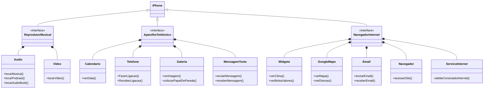

### Diagrama UML (Mermaid)

```mermaid
classDiagram
class iPhone 
iPhone <|-- ReprodutorMusical
iPhone <|-- AparelhoTelefonico
iPhone <|-- NavegadorInternet

ReprodutorMusical *-- Audio
ReprodutorMusical *-- Video
<<interface>> ReprodutorMusical
Audio: +tocarMusica()
Audio: +tocarPodcast()
Audio: +tocarAudioBook()
Video: +tocarVideo()

AparelhoTelefonico *-- Calendario
AparelhoTelefonico *-- Telefone
AparelhoTelefonico *-- Galeria
AparelhoTelefonico *-- MensagemTexto
<<interface>> AparelhoTelefonico
Calendario: +verData()
Telefone: +FazerLigacao()
Telefone: +ReceberLigacao()
Galeria: +verImagem()
Galeria: +colocarPapelDeParede()
MensagemTexto: +enviarMensagem()
MensagemTexto: +receberMensagem()


NavegadorInternet *-- Widgets
NavegadorInternet *-- GoogleMaps
NavegadorInternet *-- Email
NavegadorInternet *-- Navegador 
<<interface>> NavegadorInternet
ServicoInternet: -validarConectadoInternet ()
NavegadorInternet *-- ServicoInternet
Widgets: +verClima()
Widgets: +verBolsaValores()
GoogleMaps: +verMapa()
GoogleMaps: +verDirecao()
Email: +enviarEmail()
Email: +receberEmail()
Navegador: +acessarSite()
```
